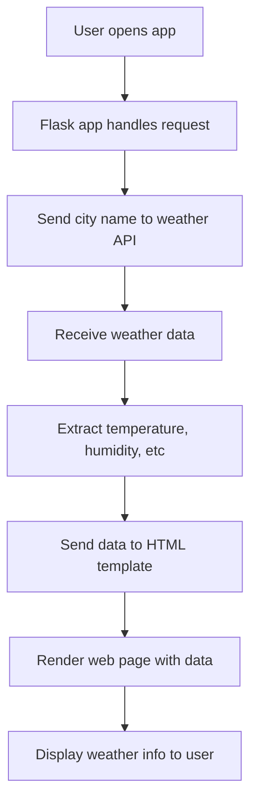

# Weather_application

LIVE DEMO : https://marutimargale.pythonanywhere.com/

## 🔁 Application Flow

The following flowchart shows how the weather application works behind the scenes:

```mermaid
graph TD
    A[User opens app] --> B[Flask app handles request]
    B --> C[Send city name to weather API]
    C --> D[Receive weather data]
    D --> E[Extract temperature, humidity, etc]
    E --> F[Send data to HTML template]
    F --> G[Render web page with data]
    G --> H[Display weather info to user]
```

